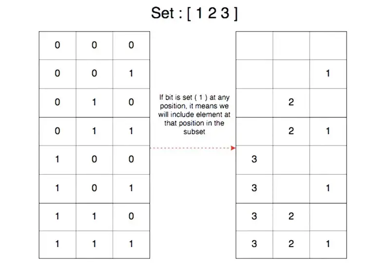

# Find all subsets of set (power set) in java

Here we will see how to find all subsets of set aka **power set**.

## Problem
> Given a set of distinct integers, arr, return all possible subsets (the power set).

### Example

For a given **set = {a, b, c}**

#### Subsets
```text
{ }
{ a }
{ b }
{ a b }
{ c }
{ a c }
{ b c }
{ a b c }
```

We will use multiple approaches here.

## Approach 1: Using recursion

You can find all subsets of set or power set using recursion. Here is a simple approach.

As each recursion call will represent subset here, we will add resultList(see recursion code below) to the list of subsets in each call.
- Iterate over elements of a set.
- In each iteration
  - Add elements to the list
  - explore(recursion) and make start = i+1 to go through remaining elements of the array.
  - Remove an element from the list.

Here is java code for recursion. [Full Code here](../../src/main/java/io/github/drmanan/learn/sets/FindSubsetsRecursion.java)

```java
void subsetsHelper(List<List<Integer>> list, List<Integer> resultList, int[] nums, int start) {
    list.add(new ArrayList<>(resultList));
    for (int i = start; i < nums.length; i++) {
        // add element
        resultList.add(nums[i]);
        // Explore
        subsetsHelper(list, resultList, nums, i + 1); // Calling it recursively
        // remove
        resultList.remove(resultList.size() - 1);
    }
}
```

Let us try to understand it with the help of the following diagram.
If you notice, each node(resultList) represents a subset here.


## Approach 2: Using bit manipulation
We can find all subsets of set or power set using iteration as well.

There will be 2^N subsets for a given set, where N is the number of elements in the set.
For example, there will be 2^4 = 16 subsets for the set {1, 2, 3, 4}.

Each ‘1’ in the binary representation indicates an element in that position.<br />
For example;
The binary representation of number 6 is 0101 that in turn represents the subset {1, 3} of the set {1, 2, 3, 4}.



How can we find out which bit is set for binary representation, 
so that we can include the element in the subset?

to check if the 0th bit is set, you can do logical & with 1.<br/>
to check if the 1st bit is set, you can do logical & with 2.<br/>
to check if the 2nd bit is set, you can do logical & with 2^2.<br/>
and so on... <br/>
To check if nth bit is set, you can do logical & with 2^n.

Let’s say with the help of example:

for a set {1, 2, 3} <br/>
0 1 1 & 0 0 1 = 1 –> 1 will be included in subset. <br/>
0 1 1 & 0 1 0 = 1 –> 2 will be included in subset. <br/>
0 1 1 & 1 0 0 = 0 –> 3 will not be included in subset.

Here is java code for the bit approach. [Full code here.](../../src/main/java/io/github/drmanan/learn/sets/FindSubsetsBitMasking.java)
```java
void printSubsets(int set[])
{
    int n = set.length;

    // Run a loop from 0 to 2^n
    for (int i = 0; i < (1<<n); i++)
    {
        System.out.print("{ ");
        int m = 1; // m is used to check set bit in binary representation.
        // Print current subset
        for (int j = 0; j < n; j++)
        {
            if ((i & m) > 0)
            {       
                System.out.print(set[j] + " ");
            }
            m = m << 1;
        }

        System.out.println("}");
    }
}
```

Here is the complete representation of bit manipulation approach.


## Approach 3: Using Backtracking

With the help of backtracking, we can generate all the subsets of the given array. For every element, we have only two options. One is to include that element in the current subset. The other is to exclude that element from the current subset. In this way, we can generate all the subsets of the given integer array.

The steps are as follows:

Step 1: Create a 2D array list answer for keeping all the subsets.<br />
Step 2: Also create a list tmp for keeping the current subset.<br />
Step 3: Make a recursive method getSubset() that has the following four parameters:<br />
Step 4: One is for keeping the current index. The second one is for storing the current subset. The third one is for storing all the generated subsets (2D list), and the fourth one is the input array.<br />
Step 5: Invoke the method with the current index as 0, empty current vector (initially, there will be no subset), the empty 2D list, and the input integer array.<br />
Step 6: In the getSubset() method, we include the ith element in to the list tmp and recursively invoke getSubset() with value i + 1.<br />
Step 7: When the method call is returned, we delete the ith element from the tmp list and then invoke getSubset() method again with i + 1.<br />
Step 8: If the value of i is the same as the size of the input array, then add the list tmp to the list answer.<br />
Step 9: Eventually, sort and display each of the sub arrays that are there in the list answer.<br />

Now let's see the implementation of the steps mentioned above. [Full code here.](../../src/main/java/io/github/drmanan/learn/sets/FindSubsetsBacktracking.java)

```java
void getSubsets(int i, ArrayList<Integer> tmp, ArrayList<ArrayList<Integer>> answer, ArrayList<Integer> inputArrList) {
    // handling the base case
    if (i == inputArrList.size()) {
    // including the generated current subset (which is non empty) to the 2D list answer
        if (!tmp.isEmpty()) {
            answer.add(tmp);
        }
        return;
    }
    // Invoking the subset that has the ith array element inside it
    ArrayList<Integer> tmp1 = new ArrayList<>(tmp);
    tmp1.add(inputArrList.get(i));
    getSubsets(i + 1, tmp1, answer, inputArrList);

    // Generating the subset that will not contain the ith array element
    getSubsets(i + 1, tmp, answer, inputArrList);
}
```