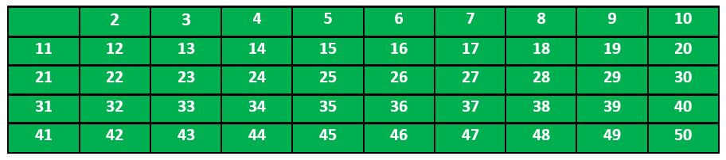
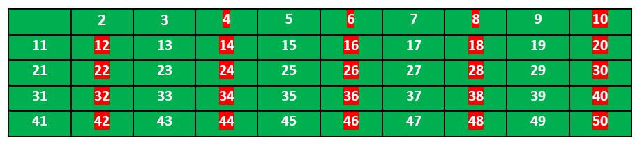
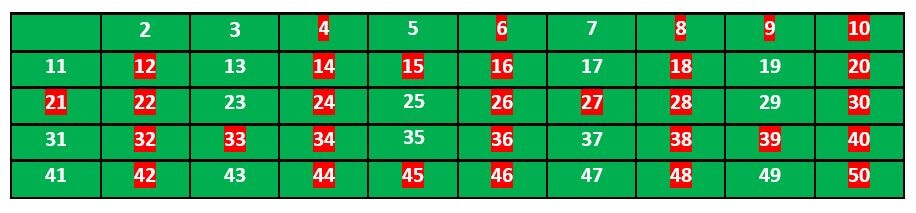
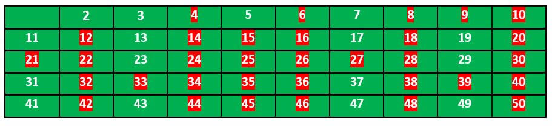
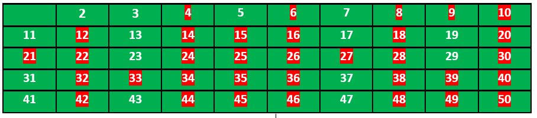

# Sieve of Eratosthenes

Given a number n, print all primes smaller than or equal to n. *It is also given that n is a small number.*

```text
Input : n =10
Output: 2 3 5 7 

Input : n = 20 
Output: 2 3 5 7 11 13 17 19
```

### Pseudocode

```text
algorithm Sieve of Eratosthenes is
input: an integer n > 1.
output: all prime numbers from 2 through n.

let A be an array of Boolean values, indexed by integers 2 to n,
initially all set to true.

for i = 2, 3, 4, ..., not exceeding √n do
    if A[i] is true
        for j = i2, i2+i, i2+2i, i2+3i, ..., not exceeding n do
            set A[j] := false

return all i such that A[i] is true.
```

To find all the prime numbers less than or equal to a given integer n by Eratosthenes' method:

1. Create a list of consecutive integers from *2* through n: (2, 3, 4, ..., n).
2. Initially, let p equal 2, the smallest prime number.
3. Enumerate the multiples of p by counting in increments of p from 2p to n, and mark them in the list (these will be
   2p, 3p, 4p, ...; the p itself should not be marked).
4. Find the smallest number in the list greater than p that is not marked. If there was no such number, stop. Otherwise,
   let p now equal this new number (which is the next prime), and repeat from step 3.
5. When the algorithm terminates, the numbers remaining not marked in the list are all the primes below n.

The main idea here is that every value given to p will be prime, because if it were composite it would be marked as a
multiple of some other, smaller prime.
Note that some numbers may be marked more than once (e.g., 15 will be
marked both for 3 and 5).

As a refinement, it is sufficient to mark the numbers in step 3 starting from p2, as all the smaller multiples of p will
have already been marked at that point. This means that the algorithm is allowed to terminate in step 4 when p2 is
greater than n.

Another refinement is to initially list odd numbers only, (3, 5, ..., n), and count in increments of 2p in step 3, thus
marking only odd multiples of p. This actually appears in the original algorithm. This can be generalized with wheel
factorization, forming the initial list only from numbers coprime with the first few primes and not just from odds (
i.e., numbers coprime with 2), and counting in the correspondingly adjusted increments so that only such multiples of p
are generated that are coprime with those small primes, in the first place.

#### Explanation, for Example:

Let us take an example when n = 50. So we need to print all prime numbers smaller than or equal to 50.

We create a list of all numbers from 2 to 50.


According to the algorithm, we will mark all the numbers which are divisible by *2* and are greater than or equal to the
square of it.

Now we move to our next unmarked number 3 and mark all the numbers which are multiples of *3* and are greater than or
equal to the square of it.

We move to our next unmarked number 5 and mark all multiples of *5* and are greater than or equal to the square of it.

We continue this process, and our final table will look like below:

So the prime numbers are the unmarked ones: 2, 3, 5, 7, 11, 13, 17, 19, 23, 29, 31, 37, 41, 43, 47.

Here is an animated example for algorithm steps for primes below 121 (including optimization of starting from prime's
square).


### Complexity: O(N*log(log(N)))

#### Other Sieves

- Atkin - [Code](../../src/main/java/io/github/drmanan/learn/numbers/SieveOfAtkin.java)
- Sundaram - [Code](../../src/main/java/io/github/drmanan/learn/numbers/SieveOfSundaram.java)
