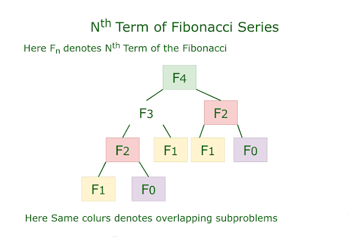

# Rules for Calculating Time Complexity

Some general rules for calculating the time complexity. Sometimes calculating time complexity becomes very complicated ,
to avoid this, these rules are going to come handy.

A very important thing to keep in mind is that we always assume that the input size is very large.

### Rule 1: Drop constant multipliers.

Eg: Given T(n) = 3n3 , find worst case running time. Using the above rule, we can drop the constant term.
Worst case running time = O(n3)

### Rule 2 : Drop lower order terms.

Eg: Given T(n) = 3n2 + 2nlogn + 5n+4 , find worst case running time.
We know that 3n2 is the highest order term. Therefore we can drop the rest of the terms .
Worst case running time = O(3n2)
We can further reduce this using 1st rule.

∴ Worst case running time = O(n2)

### Rule 3: Running time of a program= Running time of all fragments

Eg: Calculate the running time of the following program.

```java
for(int i=0;i<n;i++)
        {
        int a=5;
        a++;
        }

        for(int i=0;i<n;i++)
        {
        for(int j=0;j<n;j++)
        {
        int b=5;
        b++;
        }
        }
```

First of all we can break the program into 2 fragments. The first fragment is the first loop and the second fragment is
the second loop (nested loop). Our final answer would be the sum of both fragments.

As we know running time for simple statements like declaration, assignment, arithmetic/logical operations is O(1).

Therefore the time complexity of the first fragment would be O(n), as the loop would run n times, the time complexity of
the statements inside the loop is O(1).
Whereas the time complexity of the second fragment would be O(n2).

Time complexity of the program = O(n) + O(n2) = O(n2)

## Time Complexity Examples

Let us discuss some important examples of time complexity.

#### Example 1: The following is the program for finding the highest power less than 2. Find its Time complexity.

```java
class DivideByTwo {
    public static void f(int n) {
        while (n != 0) {
            n /= 2;
        }
    }
} 
```

**Time Complexity:** The time complexity of the above program is O(log2n) . This is because at every step we divide n by
2 .

#### Example 2: The following is the program for finding all the subsets of a given set. Find its Time complexity.

```java
get_all_subsets(List<Integer> v,List<HashSet<Integer>>sets)
{
    int subsets_count=(int)(Math.pow(2,v.size())); // notice power of 2 here
    for(int i=0;i<subsets_count; ++i){
        HashSet<Integer> set=new HashSet<Integer>();
        for(int j=0;j<v.size();++j){ // inner loop
            if(get_bit(i,j)==1){
                int x=v.get(j);
                set.add(x);
            }
        }
        sets.add(set);
    }
}
```

**Time Complexity:** As can be seen , the outer loop runs O(2^n) times, and the inner loop runs O(n) times.
Therefore, the total time complexity is the multiplication of both i.e. O(2^n * n).

#### Example 3: Let’s take the example of a fibonacci number. The following program finds the nth fibonacci number. What is its time complexity?

In fibonacci series, next number is the sum of previous two numbers for example 0, 1, 1, 2, 3, 5, 8, 13, 21, 34, 55 etc. The first two numbers of fibonacci series are 0 and 1.

```java
int fib(int n)
{
    // Base Case
    if (n <= 1)
        return n;

    // Recursive call
    return fib(n - 1) + fib(n - 2);
}
```

The derivation of the time complexity is slightly non trivial , so you can skip it if you want.

The characteristic equation of the equation ( F(n) = F(n-1) + F(n-2) ) would be x^2 - x -1 =0

Solving the above equation we would get 2 roots.

x = ( 1 + 5 )/2 and x = ( 1 - 5 )/2

As we know the solution of a linear recursive function is given as

F(n) = (1n + 2n )

Using the above fact

F(n) = ( ( 1 + 5 )/2 ) ^n + ( ( 1 - 5 )/2 ) ^n

T(n) = O ( ( ( 1 + 5 )/2 ) ^n) + O( ( ( 1 - 5 )/2 ) ^n)

T(n) = O ( ( ( 1 + 5 )/2 ) ^n)

T(n) = O ( 1.6180 ) ^n

But is this the best time complexity we can achieve? No, of course not. We can simply use dynamic programming to memoize the above program and bring down the complexity to linear.


```text
                          fib(5)   
                       /          \
               fib(4)                fib(3)   
             /        \              /       \ 
         fib(3)      fib(2)         fib(2)   fib(1)
        /    \       /    \        /      \
  fib(2)   fib(1)  fib(1) fib(0) fib(1) fib(0)
  /     \
fib(1) fib(0)
```



The time complexity of the above program would be linear i.e. O(n).

As there are only ‘n’ distinct states.

We can further reduce the time complexity to O(logn) by using ‘Matrix Exponentiation’.