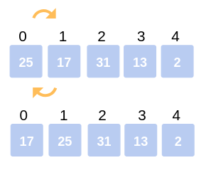
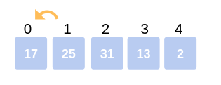
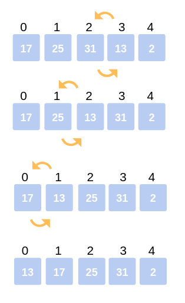
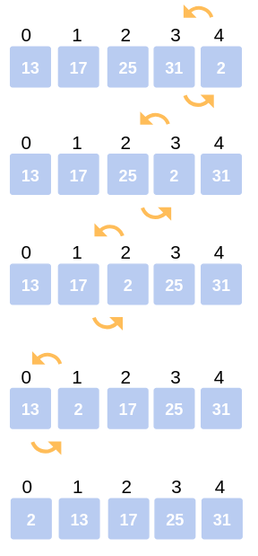

# Insertion Sort — [Code](../../src/main/java/io/github/drmanan/learn/sort/InsertionSort.java)

Insertion sort is the sorting mechanism where the sorted array is built having one item at a time. 
The array elements are compared with each other sequentially and then arranged simultaneously in some particular order. 
The analogy can be understood from the style we arrange a deck of cards. 
This sort works on the principle of inserting an element at a particular position, hence the name Insertion Sort.

  

#### Insertion Sort works as follows:
1. The first step involves the comparison of the element in question with its adjacent element.
2. And if every comparison reveals that the element in question can be inserted at a particular 
position, then space is created for it by shifting the other elements one position to the right 
and inserting the element at the suitable position.
3. The above procedure is repeated until all the element in the array is at their apt position.

### Example

Consider the following array: 
> **25, 17, 31, 13, 2.**

#### First Iteration: 
Compare 25 with 17. The comparison shows 17< 25. Hence swap 17 and 25.

The array now looks like:

> **17, 25**, *31, 13, 2*



#### Second Iteration: 
Begin with the second element (25), but it was already swapped on for the correct position, so we move ahead to the next element.
Now hold on to the third element (31) and compare with the ones preceding it.

- Since **31 > 25**, no swapping takes place.

- Also, **31 > 17**, no swapping takes place and 31 remains at its position.

The array after the Second iteration looks like:

> *17, 25, 31, 13, 2*



#### Third Iteration: 

Start the following Iteration with the fourth element (13), 
and compare it with its preceding elements.

Since **13 < 31**, we swap the two.

Array now becomes: 
> *17, 25,* **13, 31**, *2*.

But there still exist elements that we haven’t yet compared with 13. 
Now the comparison takes place between 25 and 13. Since, **13 < 25**, we swap the two.

The array becomes:
> *17*, **13, 25,** *31, 2.*

The last comparison for the iteration is now between 17 and 13. 
Since **13 < 17**, we swap the two.

The array now becomes:
> **13, 17**, *25, 31, 2.*



#### Fourth Iteration: 
The last iteration calls for the comparison of the last element (2), 
with all the preceding elements and make the appropriate swapping between elements.

Since, **2 < 31**. Swap 2 and 31.

Array now becomes: 
> *13, 17, 25,* **2, 31.**

Compare 2 with 25, 17, 13.

Since, **2 < 25**. Swap 25 and 2.

> *13, 17,* **2, 25,** *31.*

Compare 2 with 17 and 13.

Since, **2 < 17**. Swap 2 and 17.

Array now becomes:

> *13,* **2, 17,* *25, 31.*

The last comparison for the Iteration is to compare 2 with 13.

Since **2 < 13.** Swap 2 and 13.

The array now becomes:

> **2, 13**, *17, 25, 31.*

This is the final array after all the corresponding iterations and swapping of elements.



### Pseudocode

```javascript
INSERTION-SORT(A)
   for i = 1 to n
   	key ← A [i]
    	j ← i – 1
  	 while j > = 0 and A[j] > key
   		A[j+1] ← A[j]
   		j ← j – 1
   	End while 
   	A[j+1] ← key
  End for loop
```

### Time Complexity Analysis:

Even though insertion sort is efficient, still, 
if we provide an already sorted array to the insertion sort algorithm, 
it will still execute the outer for loop, thereby requiring n steps 
to sort an already sorted array of n elements, which makes its best case 
time complexity a linear function of n.

Wherein for an unsorted array, 
it takes for an element to compare with all 
the other elements which mean every n element compared with all 
other n elements. Thus, making it for n x n, i.e., n2 comparisons. 
One can also take a look at other sorting algorithms such as Merge sort, 
Quick Sort, Selection Sort, etc. and understand their complexities.

> Worst Case Time Complexity: Ο(n^2) ***Big-O***

> Best Case Time Complexity: Ω(n) ***Big-omega***

> Average Time Complexity: Θ(n^2) ***Big-theta***