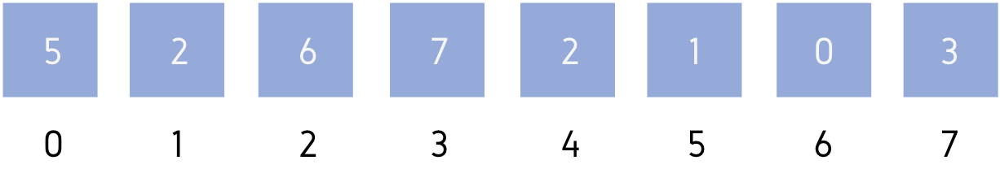
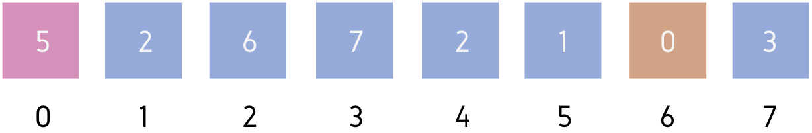
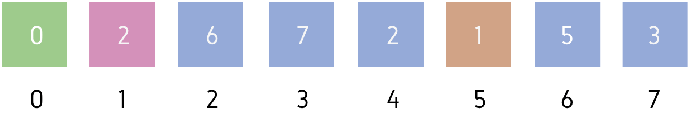
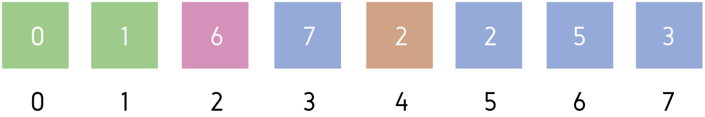
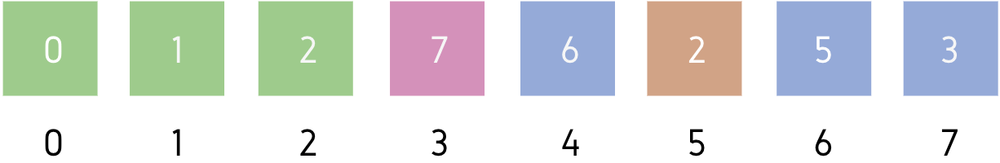
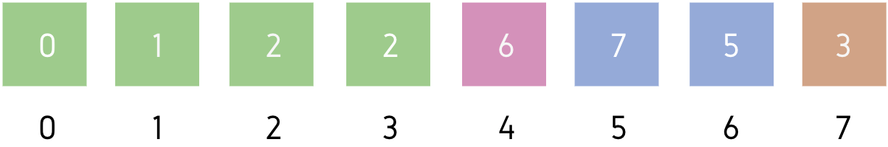
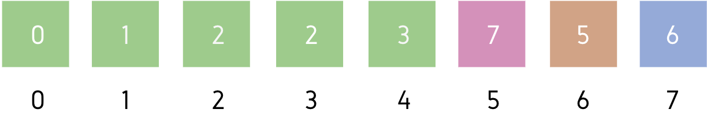
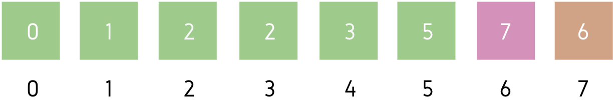
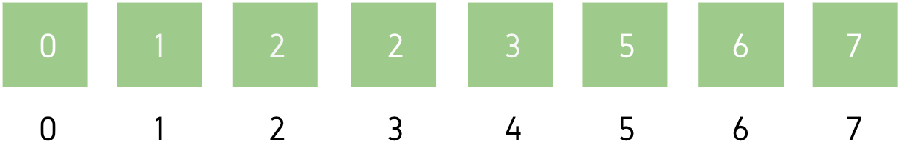

# Selection Sort  — [Code](../../src/main/java/io/github/drmanan/learn/sort/SelectionSort.java)

The idea behind this algorithm is pretty simple. We divide the array into two parts: sorted and unsorted. The left part is sorted subarray and the right part is unsorted subarray. Initially, sorted subarray is empty and unsorted array is the complete given array.

We perform the steps given below until the unsorted subarray becomes empty:
- Pick the minimum element from the unsorted subarray.
- Swap it with the leftmost element of the unsorted subarray.
- Now the leftmost element of unsorted subarray becomes a part (rightmost) of sorted subarray and will not be a part of unsorted subarray.

#### A selection sort works as follows:
 
Part of unsorted array<br/>

Part of sorted array <br />

Leftmost element in an unsorted array <br />

Minimum element in unsorted array

### Example


This is our initial array 
> **A = [5, 2, 6, 7, 2, 1, 0, 3]**



Leftmost element of unsorted part = **A[0]** <br />
Minimum element of unsorted part = **A[6]** <br />
We will swap **A[0]** and **A[6]** then, make **A[0]** part of sorted subarray.



Leftmost element of unsorted part = **A[1]** <br />
Minimum element of unsorted part = **A[5]** <br />
We will swap **A[1]** and **A[5]** then, make **A[1]** part of sorted subarray.



Leftmost element of unsorted part = **A[2]** <br />
Minimum element of unsorted part = **A[4]** <br />
We will swap **A[2]** and **A[4]** then, make **A[2]** part of sorted subarray.



Leftmost element of unsorted part = **A[3]** <br />
Minimum element of unsorted part = **A[5]** <br />
We will swap **A[3]** and **A[5]** then, make **A[3]** part of sorted subarray.



Leftmost element of unsorted part = **A[4]** <br />
Minimum element of unsorted part = **A[7]** <br />
We will swap **A[4]** and **A[7]** then, make **A[4]** part of sorted subarray.



Leftmost element of unsorted part = **A[5]** <br />
Minimum element of unsorted part = **A[6]** <br />
We will swap **A[5]** and **A[6]** then, make **A[5]** part of sorted subarray.



Leftmost element of unsorted part = **A[6]** <br />
Minimum element of unsorted part = **A[7]** <br />
We will swap **A[6]** and **A[7]** then, make **A[6]** part of sorted subarray.



This is the final sorted array.

### Pseudocode

#### Find index of the minimum value

Suppose, there are ‘n’ elements in the array. 
Therefore, at the worst case, 
there can be n iterations in FindMinIndex() 
for start = 1 and end = n. 
We did not take any auxiliary space.

```postgresql
FindMinIndex(Arr[], start, end)    
        min_index = start    
        
        FOR i from (start + 1) to end:    
            IF Arr[i] < Arr[min_index]:    
                min_index = i    
            END of IF    
        END of FOR    
              
  Return min_index
```

> Time complexity: O(n)
> 
> Space complexity: O(1)
 
#### Selection Sort

Suppose, there are ‘n’ elements in the array. Therefore, at the worst case, 
there can be n iterations in FindMinIndex() for start = 1 and end = n. 
No auxiliary space used.

**Total iterations = (n – 1) + (n – 2) + . . . + 1 = (n * (n – 1)) / 2 = (n2 – n) / 2**

> Time complexity: O(n^2)
>
> Space complexity: O(1)
 
