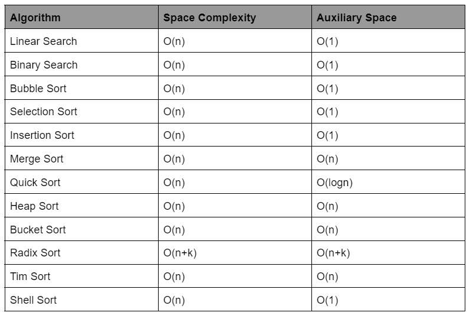

# Space Complexity

### What is Space Complexity and How to Calculate it?

Space complexity is a measure of how efficient your code is in terms of memory used.

Space complexity analysis happens almost in the same way time complexity analysis happens, i.e., it is measured by calculating the total space taken by an algorithm with respect to the input.

E.g.: Let’s take the following example:
```java
vector<int> V;
for (int i = 0; i < N; i++) 
    V.push_back(i);
```
The code snippet ends up creating a vector of size N. So, space complexity of the code is O(n).

E.g.: Let’s take another example. Let’s say we need to create a 2-D array of size n*n.
The space complexity in this case would be O(n2).

Similar to Space complexity, there is another concept called Auxiliary Space.

Auxiliary space is the extra space used by the algorithm apart from the input space.

E.g.: The following is the code for calculating the sum of an input array.
```java
int sum(int arr[], int n)
{
    int sum=0;
    for (int i=0 ; i< n ; i++)
    {
        sum+=arr[i];
    }
    return sum;
}
```
In the above algorithm apart from the input array, we only declare one variable *sum*.
Therefore, for the above algorithm,
- Auxiliary Space = O(1)
- Space complexity = O(n)

### Difference between Time Complexity and Space Complexity:
Now that we know what time complexity and space complexity is, and how to calculate them, Let's discuss some key differences between them.

| **Time Complexity**                                                                                        | **Space Complexity **                                                                                         |
|------------------------------------------------------------------------------------------------------------|---------------------------------------------------------------------------------------------------------------|
| Time Complexity is the time taken by an algorithm/program to run as a function of the length of the input. | Space Complexity is the total amount of memory used by an algorithm to run.                                   |
| Depends on the input size.                                                                                 | Depends mostly on the auxiliary size.(i.e the extra space used).                                              |
| For modern hardware, it is more important to reduce your time complexity.                                  | For modern hardware, it is less important to reduce your space complexity as compared to the time complexity. |

#### Space Complexity Cheat Sheet
Here’s a list of some famous algorithms and their space complexities.
